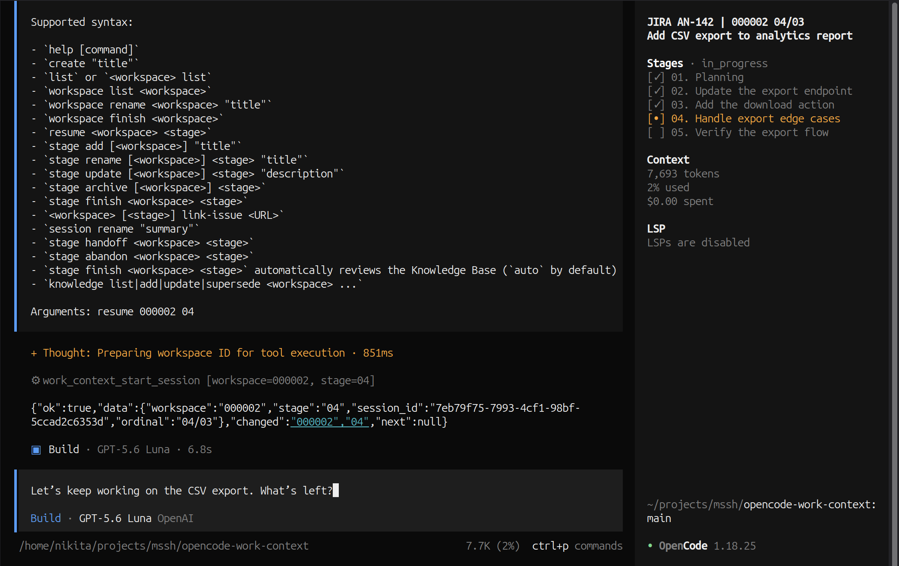

# OpenCode Work Context

Keep the context of a task between OpenCode sessions.

Create one workspace for one task, split it into stages, and return to the
exact stage where you stopped. The optional sidebar and modal show the current
task and its progress at a glance.



> Example: one workspace for one task, linked to Jira issue `AN-142`, with
> three completed stages and the current work highlighted at stage 04.
>
> The sidebar is an optional read-only TUI panel. The core workflow works
> through `/wc` commands and OpenCode tools without it.

Work-context session titles put the stage title first so OpenCode's session
picker remains easy to scan. The second line carries the workspace and stage
IDs, session ordinal, optional issue reference, and inactive state. In the
optional sidebar, the workspace title is shown separately above the stages
panel.

## How It Works

```text
Workspace: Add CSV export to analytics report
├── ✓ 01. Planning
├── ✓ 02. Update the export endpoint
├── ✓ 03. Add the download action
├── • 04. Handle export edge cases   <- current stage
└──   05. Verify the export flow
```

- **Workspace** is one concrete task, such as adding CSV export.
- **Stage** is one step in that task.
- **Planning** is normally the first stage.
- **Resume** starts a new session at a selected stage.
- **Handoff** preserves the context when moving work to another session.

## Quick Start

Run this from the root of a standalone OpenCode project:

```sh
npx opencode-work-context init
```

Then create a task and its first stage in OpenCode:

```text
/wc create "Add CSV export to analytics report"
/wc stage rename 000001 01 "Planning"
/wc stage add 000001 "Update the export endpoint" "Inspect the current endpoint, implement CSV export, add regression tests, and verify the result."
/wc resume 000001 02
```

`stage add` only creates a `planned` stage. It never starts that stage or binds
the current OpenCode session to it. Open a separate OpenCode session and use
`/wc resume <workspace> <stage>` explicitly for every transition into an added
stage. Multiple sessions may work on the same non-terminal stage through
explicit resume and handoff operations.

When you return later, continue from the active stage. A stage must have a
non-empty prompt before implementation begins; if the prompt is missing or
ambiguous, `/wc resume` instructs the agent to ask focused questions first.
Before working, the agent reports the stage essence, the previous session's
result or stopping point, and what it will do now. On subsequent resumes, it
only reports that context and waits for explicit confirmation before continuing:

```text
/wc resume 000001 02
```

Useful commands:

```text
/wc list
/wc workspace list 000001
/wc stage handoff 000001 02
/wc stage finish 000001 02
```

Workspace and stage IDs accept their canonical padded form or an unpadded
positive integer. Workspace IDs use `1..999999`; stage IDs use `1..99`.
Results, storage, logs, UI, and generated commands always use six-digit
workspace IDs and two-digit stage IDs, so these pairs are equivalent:

```text
/wc workspace list 000004
/wc workspace list 4
/wc resume 000004 02
/wc resume 4 2
/wc stage handoff 000004 02
/wc stage finish 4 2
```

Zero, signs, decimals, surrounding whitespace, overlong values, and other
non-digit forms are invalid. A single identifier keeps the command grammar's
existing disambiguation rule: six digits mean workspace; one or two digits mean
stage. Use explicit workspace and stage positions for unpadded workspace IDs.

## Install

Run from the root of a standalone OpenCode project:

```sh
npx opencode-work-context init
```

`init` installs the current package version as an exact devDependency using
standard `npm`, preserving normal lifecycle behavior for the host project. The
dependency root is the project root when it has `package.json`, otherwise
`.opencode` when `.opencode/package.json` exists, and finally the project root
with a new `package.json` when neither exists. Package files, lockfiles, and
`node_modules` are changed only in that dependency root; integration files and
`.gitignore` always belong to the project root.

The installer ensures that the dependency-root package uses `"type": "module"`
and generates ESM server and TUI loaders. OpenCode loads local plugins as JavaScript
modules; keeping the generated `.js` integration path ESM avoids a CommonJS
interop failure before custom tools are registered.
It does not create a workspace. Start one explicitly with `/wc create "Title"`.

Use `--force` to replace a conflicting package-owned generated file or package
version. Without it, existing files are never silently overwritten. Re-running
with unchanged files is safe and idempotent.

## Update

Run the update from the root of the OpenCode project that has the plugin
installed:

```sh
npx --yes opencode-work-context@latest init --force
```

This installs the latest package version as an exact devDependency and refreshes
the package-owned server and TUI loaders. It preserves the project's
`.work-context` data. Check the installed version with:

```sh
npm ls opencode-work-context --depth=0
```

Restart OpenCode after updating so it reloads the new server plugin, TUI loader,
keymap, and modal code. A restart is required after changing package code or
`.opencode/tui.json`; lifecycle data changes are picked up by the existing
refresh mechanisms.
Use a specific version instead of `latest` when you need a pinned upgrade, for
example `npx --yes opencode-work-context@0.1.10 init --force`.

Generated files:

- `.work-context/config.yaml` for filesystem configuration;
- `.opencode/commands/wc.md` for the `/wc` command contract;
- `.opencode/plugins/work-context.js` as a thin loader from the installed package;
- `.opencode/tui-plugins/work-context-stages.js` as the reactive stages-panel loader;
- `.work-context/local/` in `.gitignore` for personal session events.
- `<workspace>/KNOWLEDGE.md` is the canonical durable knowledge ledger and is
  created on the first explicit knowledge operation.

The optional stages panel, action modal, and stage switcher are a separate TUI plugin. `init` installs a
project-local loader outside OpenCode's server-plugin autoscan at
`.opencode/tui-plugins/work-context-stages.js` and enables it in `.opencode/tui.json`:

```js
export { default } from "opencode-work-context/tui";
```

Enable that loader explicitly in `.opencode/tui.json`:

```json
{ "$schema": "https://opencode.ai/tui.json", "plugin": ["./tui-plugins/work-context-stages.js"] }
```

The package keeps the existing `opencode-work-context/plugin` server export and
also exposes the explicit server entry as `opencode-work-context/server`.
The combined TUI adapters are exposed only as `opencode-work-context/tui`. They
read canonical storage through the package core and never edit Markdown or
JSONL projections directly. Hosts without the TUI plugin API continue to load
the server plugin and its tools normally.

`Ctrl+Alt+W` runs `work_context.open` and opens a searchable stage switcher for
the current workspace. Selecting a stage opens its active OpenCode-backed
session, or otherwise its most recently updated OpenCode-backed session. If the
stage has no available session, the switcher creates a separate OpenCode
session, opens it, and executes the public `wc resume <workspace> <stage>`
command in that destination session. The command invokes the canonical
`work_context_start_session` flow and gives the destination agent its resume
context. It never rebinds, closes, or submits work in the session being left.
Completed, cancelled, archived, or dependency-blocked stages can open an
existing session but cannot create a new one. Cancelling the selector changes
nothing. A failed canonical start removes the newly created OpenCode session
when the host supports deletion; a navigation failure leaves the new linked
session available for a later switch.

The command palette still exposes `work_context.actions` for the broader action
modal. Its command actions only prepare visible `/wc` commands and never submit
or invoke an LLM. The switcher uses OpenCode's public structured session-command
endpoint rather than inserting `/wc resume` text into either prompt.
The shortcut is registered with the public keymap layer. If another plugin or
terminal reserves `Ctrl+Alt+W`, remove or change the conflicting binding, or
disable this TUI loader; the package does not use an internal keymap fallback.

Tools are registered by the installed server export and are not copied into the
project. Core and storage remain in the installed package; projects should not
copy `src/` or `tools/`. `.work-context` Markdown, JSONL, `INDEX.md`, and
`SESSIONS.md` are generated projections and must never be edited manually.
Tracker links support GitLab issues (`/-/issues/<number>`), GitHub issues
(`/issues/<number>`), and Jira issues (`/browse/KEY-123`). They are URL-based
references only; the plugin does not call provider APIs or synchronize issue
metadata.
Knowledge operations are explicit: list, add, update, and supersede. Finishing a
stage always validates the Knowledge Base and reports its total and active entry
counts. Before finishing, persist new durable findings, update changed entries,
supersede obsolete entries, or explicitly use `knowledgeReview=none` when no
durable findings were produced. The default `knowledgeReview=auto` remains
accepted, and `knowledgeReview=added` records that the ledger was changed.
Every stage start/resume includes all active entries in
`resume.context.workspace_knowledge`. Agents should treat this as established
workspace-wide context and avoid repeating earlier analysis unless an entry is
incomplete, contradicted, or requires verification. Superseded entries and full
stage results are not injected into later stages.
Finishing a stage closes its current session and may report downstream stages
whose prompts need review, but it never starts or resumes one of them. Any
downstream work begins only in a separate OpenCode session through an explicit
`/wc resume <workspace> <stage>` operation.
Finish a workspace explicitly with `/wc workspace finish <workspace>`; it is
accepted only after every stage is `completed`. Use `/wc workspace list <workspace>`
to list stages with their descriptions. Workspace titles can be changed with
`/wc workspace rename <workspace> "title"`, and existing stage descriptions can
be changed with `/wc stage update <workspace> <stage> "description"`.

If the host `opencode.json` restricts `experimental.primary_tools`, add the
registered `work_context_*` tool names to that allowlist; the installer does not
rewrite project-specific agent policy.

## Release

Maintainers publish this package only through
`.github/workflows/release.yml` and npm Trusted Publishing with GitHub Actions
OIDC. Do not create npm publish tokens or run `npm publish` locally.

From a clean checkout, run the release checks:

```sh
npm test
npm run test:tui
npm run check:language
npm pack --dry-run
git diff --check
```

Then create and push the release commit and matching tag:

```sh
npm version patch
git push origin main
git push origin v<version>
```

Use `minor` or `major` instead of `patch` when required. The tag must exactly
match the version in `package.json`. Pushing the tag runs the complete release
workflow and publishes through short-lived OIDC credentials with automatic
provenance. Monitor the GitHub Actions run and verify the version and `latest`
dist-tag in the npm registry. Never reuse or move a tag that has already been
pushed or published.

## License

MIT. Copyright (c) 2026 Nikita Mosiyash.

## Manual fallback

For an offline or advanced setup, install the package as a devDependency and add
the equivalent plugin loader and `/wc` command from this repository. Keep the
plugin import pointed at `opencode-work-context/plugin`; do not copy `src/` or
individual tools into the project.

## Development

The package layout is intentionally small:

- `src/` contains the dependency-free core, storage, projections, and adapter;
- `plugin/` exposes the OpenCode plugin contract;
- `tools/` exposes individual tool contracts;
- `bin/` contains the `init` CLI;
- `commands/` contains the reusable `/wc` prompt;
- `test/` contains core contract tests.

Run `npm test` when explicitly verifying a checkout.

Run `npm run test:integration` for the reusable plugin-boundary scenarios. These
tests create isolated fixture projects, use a small fake OpenCode host, and
exercise a new session resume through the server title hook and read-only TUI
snapshot without requiring an interactive OpenCode process.
